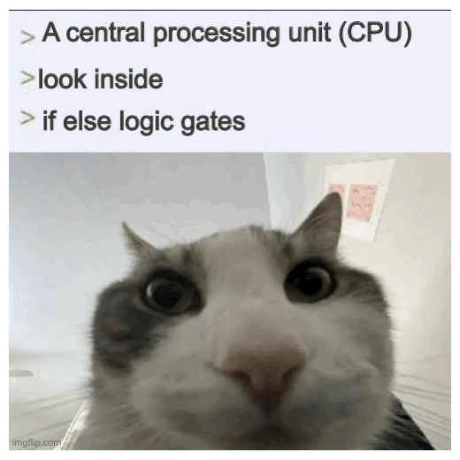
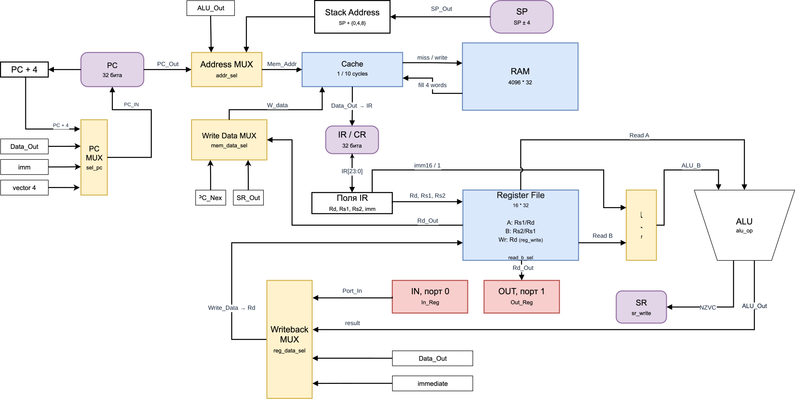

# Лабораторная работа №4. Эксперимент 
## (Вариант: lisp | risc | neum | hw | trap | port | pstr | cache | alg2)

**Студент:** Малых Кирилл Романович, P3232  
**Преподаватель:** Пенской Александр Владимирович  

---

<p align="center">
  
</p>

## Table of Contents

- [Язык программирования](#язык-программирования)
- [Организация памяти](#организация-памяти)
- [Система команд](#система-команд)
- [Транслятор](#транслятор)
- [Модель процессора](#модель-процессора)
- [Тестирование](#тестирование)

---

## Язык программирования

Разработанный язык программирования представляет собой минималистичный диалект **Lisp** с поддержкой рекурсивных функций, глобальных и локальных переменных, арифметических операций, условных ветвлений и асинхронных прерываний (ибо того требует вариант).

### Синтаксис

```ebnf
program     = expression ;

expression  = number | string | name | list ;

list        = "(" , form , ")" ;

form        = setq | defun | definterrupt | progn | if
            | aref | aset | io | unary | binary | call ;

setq        = "setq" , name , expression ;
defun       = "defun" , name , "(" , { name } , ")" , expression ;
definterrupt= "definterrupt" , name , "(" , ")" , expression ;
progn       = "progn" , expression , { expression } ;
if          = "if" , expression , expression , expression ;

aref        = "aref" , expression , expression ;
aset        = "aset" , expression , expression , expression ;

io          = "in" , "0"
            | "out" , "1" , expression
            | "print" , expression
            | "ei" | "di" ;

unary       = ( "not" | "inc" | "dec" ) , expression ;

binary      = ( "+" | "*" ) , expression , expression , { expression }
            | ( "-" | "/" | "%" | "and" | "or" | "xor"
              | "lsl" | "lsr" | "<<" | ">>" ) , expression , expression
            | ( "=" | "!=" | "<" | "<=" | ">" | ">=" ) , expression , expression ;

call        = name , { expression } ;

number      = [ "-" ] , digit , { digit } ;
string      = '"' , { character - '"' } , '"' ;
name        = letter , { letter | digit | "_" } ;
comment     = ";" , { character - newline } , newline ;
```

В самом языке нет так такого булевого типа данных, но можно использовать сравнение вне условия, которое будет возвращать либо единицу, либо ноль, а внутри позиции условия `if` транслятор преобразует его в команду ветвления.

### Семантика
* **Стратегия вычислений:** аппликативная, то бишь операнды и аргументы вычисляются слева направо, а аргументы до передачи управления функции.

* **Области видимости:** глобальные переменные хранятся в статической памяти данных `symbol_table`, и их первое `setq` должно предшествовать использованию в исходнике.<br> Аргументы функций `defun` размещаются в регистрах и, что важно, затеняют глобальные имена при чтении и присваивании. <br> Внутри функции доступны её собственные аргументы и объявленные глобальные переменные. <br>Обработчик прерывания не захватывает аргументы окружающей функции.

* **Типизация:** динамическая слабая. На борту мы имеет только целые 32-битные числа и Паскаль-строки. <br>Все языковые конструкции являются выражениями, например:<br> (`statement-as-expression`): `(print (setq x 13))`, `(setq x (if (= 1 x) 2 3))`, `(setq flag (= 1 x))` и `(print_str (if (= 1 x) yes no) 1)`<br> - корректный код, что собран в golden-тесте [expressions.yml](tests/golden/expressions.yml). <br>
Конструкции `ei`, `di` и `defun` значения не возвращают, посему попытка использовать их как операнд даёт ошибку трансляции.

* **Печать:** `print` и `out` выводят одно значение, то есть один символ или число. Строка в данном контексте — это просто указатель, поэтому печатается она функцией на самом языке через `aref`, как того требует вариант `pstr`. <br>Пример такой функции есть в каждом golden-тесте со строками.

* **Рекурсия:** поддерживается в полном объёме. Самовызов в хвостовой позиции транслятор превращает в переход на начало функции, поэтому циклы по типу `(defun wait () (wait))` работают бесконечно и не расходуют стек, что очень круто и прикольно.

### Литералы

| Вид | Пример | Где размещается |
|-----|--------|-----------------|
| Целое число от 0 до 65535 | `42` | Непосредственно в команде `LDI` |
| Отрицательное или большое число | `-1`, `70000` | Собирается в регистре парой `LDI` + `LSL` + `OR` |
| Строка | `"La-li-lu-le-lo"` | Сегмент данных, формат Паскаль-строки |

---

## Организация памяти

Модель памяти процессора построена по принципу **фон Неймановской архитектуры** (или Принстонской, кому как приятнее), то бишь:
* Единое адресное пространство размером **16384 байта**, то есть 4096 32-битных слов.

* Адресация байтовая: машинное слово занимает 4 последовательных байта, все обращения выровнены по границе слова, `PC` увеличивается на 4.
* **Разделение адресного пространства:**

```text
       Единая память (4096 слов)
+--------------------------------------+
| 0000        : JMP _start             |  вектор сброса
| 0004        : JMP обработчик / IRET  |  вектор прерывания
| 0008        : начало программы       |
|    ...                               |  .text, тела функций и обработчиков
| 3996                                 |
+--------------------------------------+
| 4000        : переменная / строка    |  .data
|    ...                               |  глобальные переменные и Паскаль-строки
| 12396                                |
+--------------------------------------+
| 12400                                |  .stack, растёт вниз
|    ...                               |
| 16380       : вершина стека SP.      |
+--------------------------------------+
```

Адреса процессора байтовые. Память доступна командами чтения и записи целого слова, поэтому адрес слова должен быть кратен 4 (!!!!).

* Сегмент кода: `0x0000..0x0F9F`, 1000 команд.
* Сегмент данных: `0x0FA0..0x306F`, 2100 слов.
* Стек: `0x3070..0x3FFF`, `SP` инициализируется адресом 16380 и растёт вниз с шагом 4.

Транслятор проверяет, что код не вышел за адрес 4000, а данные — за адрес 12400, и отказывается собирать программу, если сегменты пересекаются. Модель процессора следит за `SP` и останавливается с проверкой при переполнении или опустошении стека.

### Работа с данными

1. **Литералы.** Число, помещающееся в 16 бит, попадает прямо в поле команды `LDI`, непосредственная адресация. Число, больше 16 бит, собирается в регистре в два приёма путём отдельной загрузки старшей и младшей части, потому что поле команды физически меньше машинного слова. В статическую память числовые литералы не выносятся.

2. **Константы.** В контесте моего варика такого понятия константы в языке нет, любое именованное значение — это переменная.
3. **Переменные.** Глобальные переменные живут в сегменте данных: каждому новому имени при первом `setq` выделяется одно слово, адреса раздаются подряд от 4000 с шагом 4. Обращение идёт парой `LDI` + `LD`/`ST`. А аргументы функции отображаются на регистры и в памяти не хранятся вовсе.
4. **Строки.** Строковый литерал размещается в сегменте данных в формате Паскаль-строки: первое слово — длина, далее по одному ASCII коду на машинное слово. Выражение со строкой возвращает адрес её начала, то есть указатель. Строки размещаются подряд по мере встречи в тексте программы. Работа со строками ведётся функциями на самом языке через команды `aref` и `aset`.<br>Поскольку адресация байтовая, а элемент массива занимает слово, `aref` и `aset` умножают индекс на 4 сдвигом влево на два разряда.
5. **Инструкции.** Одна инструкция — одно машинное слово, то бишь 4 байта. Программа начинается с таблицы векторов из двух слов, далее идёт дефолтный код.
6. **Процедуры.** Тело функции размещается в сегменте кода по месту объявления, транслятор обходит его командой `JMP`. Вызов сохраняет адрес возврата в стек командой `CALL`. Перед вызовом активные регистры сохраняются в стек, после возврата восстанавливаются. Хвостовой самовызов компилируется в `JMP` и наш стек не трогает.
7. **Прерывания.** Обработчик размещается в сегменте кода, а по адресу 4 ставится переход на него. Если обработчик не объявлен, по адресу 4 стоит `IRET`. `PC` и `PS` сохраняются аппаратно. Для обработчика без вызовов транслятор генерирует `PUSH`/`POP` для регистров, упомянутых в его машинном коде. При наличии вызова сохраняются `R1, R10`, поскольку вызванная функция может менять любой регистр из этого набора.

### Распределение регистров

Регистры `R1,R10` используются как стек вычислений: каждое промежуточное значение занимает очередной свободный регистр и освобождается сразу после использования. Первые n регистров заняты аргументами текущей функции.

Если выражение настолько глубоко вложено, что регистров не хватает, транслятор останавливается с ошибкой «закончились свободные регистры». Выгрузка регистров в память не реализована сознательно: предел достигается где-то на уровне одиннадцатом вложенности, что для задач варианта избыточно (давайте переложим ответственность на программистов, которые не используют стек).

---

## Система команд

Процессор реализован по принципам архитектуры **RISC** со Register-To-Register ISA. Ключевые приколы:
* Фиксированная длина инструкций, а если быть точнее, то **4 байта**.
* Преобразовани данных происходит целиком и полностью внутри регистров.
* Доступ к памяти осуществляется отдельными командами `LD` и `ST`.
* Регистровый файл: 16 регистров (`R0` – `R15`), где `R0` аппаратно заземлен на ноль, а `PC`, `SP`, `CR` и `PS` - регистры на уровне микроархи.

### Кодирование инструкций

Все команды занимают ровно одно 32-битное слово. Используются два формата:

```text
Регистровый формат (три регистра)
 31      24 23   20 19   16 15   12 11            0
+----------+-------+-------+-------+---------------+
|  opcode  |  Rd   |  Rs1  |  Rs2  |   не исп.     |
+----------+-------+-------+-------+---------------+
     8         4       4       4          12

Формат с непосредственным операндом
 31      24 23   20 19   16 15                    0
+----------+-------+-------+-----------------------+
|  opcode  |  Rd   |  Rs1  |      immediate        |
+----------+-------+-------+-----------------------+
     8         4       4              16
```

Первый формат применяется к трёхрегистровым операциям АЛУ (`ADD`, `SUB`, `MUL`, `DIV`, `MOD`, `AND`, `OR`, `XOR`, `LSL`, `LSR`), второй — ко всем остальным командам. Поле `immediate` хранит константу, адрес перехода, смещение при обращении в память или номер порта.

Примеры:

```text
0x04123000   ADD R1, R2, R3      opcode=04, Rd=1, Rs1=2, Rs2=3
0x0110002A   LDI R1, 42          opcode=01, Rd=1, imm=0x002A
0x02120004   LD  R1, R2, 4       opcode=02, Rd=1, Rs1=2, imm=4
0x1C100001   OUT 1, R1           opcode=1C, Rd=1, imm=1 (номер порта)
0x12000044   JMP 68              opcode=12, imm=0x0044 (байтовый адрес)
```

### Набор инструкций и количество тактов

Полный цикл команды — это последовательность шагов счётчика `Step Counter`: `T0 Fetch`, `T1 Decode`, `T2 Execute`, при необходимости `T3 Mem/WB`. Каждый шаг, очевидно, занимает один такт. Плюсом ко всему, в рамках моего варианта, 10 тактов занимает время, за которое проц обратится к памяти, при этом один такт, если данные достали из кеша.

| Команда | Действие | Всё в кеше | Промах выборки | Промах выборки и данных |
|---------|----------|-----------:|---------------:|------------------------:|
| `LDI Rd, imm` | `imm -> Rd` | 3 | 12 | — |
| `ADD/SUB/MUL/DIV/MOD Rd, Rs1, Rs2` | арифметика | 3 | 12 | — |
| `AND/OR/XOR/LSL/LSR Rd, Rs1, Rs2` | логика и сдвиги | 3 | 12 | — |
| `NOT Rd, Rs1` | `~Rs1 -> Rd` | 3 | 12 | — |
| `INC/DEC Rd` | `Rd ± 1 -> Rd` | 3 | 12 | — |
| `CMP Rd, Rs1` | `Rd - Rs1 -> NZVC` | 3 | 12 | — |
| `JMP/JZ/JNZ/JL/JGE addr` | переход | 3 | 12 | — |
| `IN Rd, port` | порт `-> Rd` | 3 | 12 | — |
| `OUT port, Rd` | `Rd ->` порт | 3 | 12 | — |
| `EI` / `DI` | разрешить/запретить прерывания | 3 | 12 | — |
| `LD Rd, Rs1, off` | `Mem[Rs1+off] -> Rd` | 4 | 13 | 22 |
| `POP Rd` | снять со стека | 4 | 13 | 22 |
| `RET` | возврат из функции | 4 | 13 | 22 |
| `ST Rd, Rs1, off` | `Rd -> Mem[Rs1+off]` | 13 | 22 | — |
| `PUSH Rd` | положить в стек | 13 | 22 | — |
| `CALL addr` | вызов функции | 13 | 22 | — |
| `IRET` | возврат из прерывания | 5 | 14 | 23 |
| `HLT` | останов | 2 | 11 | — |

Запись идёт сквозная, поэтому всегда стоит 10 тактов независимо от состояния кеша. Аппаратный вход в прерывание состоит из двух последовательных записей (`T4 SAVE PC`, `T4 SAVE PS`), итого 20 тактов.

Для `IRET` общее время получается как выборка + 2 + чтение PS + чтение PC. В таблице для промаха данных показан случай, когда оба слова стека лежат в одной кеш-строке. Если оба чтения стека промахнулись и выборка тоже промахнулась, то, беда беда, получится 32 такта.

### Ввод-вывод

Тут мы имеем **PMIO**: порт `0` — ввод, порт `1` — вывод. Обращение возможно только командами `IN` и `OUT`, номер порта кодируется в поле `immediate`.

Внешнее устройство имеет у себя один регистр данных и одну линию запроса. Получив байт, устройство кладёт его в регистр `In_Reg` и поднимает `dev_signal` как запрос о прерывании. Команда `IN` забирает байт и снимает запрос. Если новый байт приходит раньше, чем процессор прочитал предыдущий, предыдущий теряется, и модель пишет об этом в журнал.

### Система прерываний

Прерывания внутренние и обрабатываются аппаратно. Запрос образуется схемой `И`: `IRQ = dev_signal & IE`. Процессор проверяет запрос на границе команд, в том числе после завершения ожидающей операции памяти. При входе он запоминает старый `PS`, сбрасывает `IE`, последовательно сохраняет `PC` и старый `PS` в стек и загружает байтовый адрес вектора `0x0004` в `PC`.

Вложенные прерывания запрещены, пока установлен `int_active`. Если новый байт пришёл после `IN`, запрос остаётся активен и обслуживается после `IRET`, когда восстановленный `PS` разрешает прерывания. Если новый байт пришёл до `IN`, он затирает непрочитанный. Оба случая есть в golden-тесте `interrupt_burst`.


## Транслятор

Консольное приложение `translator.py` реализует двухпроходный компилятор.

**Интерфейс командной строки:**
```bash
python3 src/translator.py -i <input.lisp> -o <target.bin> [-l <listing.txt>]
```

| Ключ | Назначение |
|------|------------|
| `-i`, `--input` | Исходный файл на разработанном языке |
| `-o`, `--output` | Выходной бинарный файл с машинным кодом |
| `-l`, `--listing` | Отладочный листинг (необязательно) |

**Этапы трансляции:**
1. **Токенизация**, во время которого идёт разбиение текста на токены с сохранением строковых литералов и удалением комментариев на `;`.
2. **Парсинг** с рекурсивным спуском и с построением вложенного дерева s-выражений.
3. **Сбор сигнатур** с предварительным обходом дерева, дабы функция была видна в кода до её объявления, ну и чтоб избежать дублирования названий функций.
4. **Семантический анализ**, где я проверяю зарезервированные имена переменных и функций, валидация портов и лимита регистров.

5. **Генерация кода** с рекурсивным обходом, динамическое выделение регистров `R1,R10` и трансляция в RISC-инструкции. Тело функции компилируется в хвостовой позиции, самовызов превращается в переход.
6. **Компоновка (Линковка)**, где происходит двухпроходное разрешение символических меток в числовые адреса памяти, а также построение таблицы векторов.
7. **Сериализация:** запись 32-битного дампа памяти в бинарник через `struct.pack` и генерация отладочного листинга вида `<адрес> - <хекскод> - <мнемоника>`.


## Модель процессора

Консольное приложение `machine.py` реализует потактовый симулятор процессора с жесткой логикой управления Hardwired Control Unit и кэш-памятью.

**Интерфейс командной строки:**
```bash
python3 src/machine.py -c <code.bin> [-i <input.txt>] [-t <max_ticks>] [--no-cache]
```

| Ключ | Назначение |
|------|------------|
| `-c`, `--code` | Бинарный файл с машинным кодом |
| `-i`, `--input` | Текст ASCII (пробелы и переводы строк сохраняются) или файл `.json` со списком пар `[такт, значение]` |
| `-t`, `--ticks` | Общий лимит тактов. По умолчанию 20 000 тактов после последнего события ввода или 5000 от старта, если ввода нет |
| `-l`, `--listing` | Листинг трансляции: в журнал попадут строки исходника |
| `--no-cache` | Отключить кеш, каждое обращение в память стоит 10 тактов |

Текстовый файл подаёт первый символ на такте 50, остальные с интервалом 1500 тактов. Для числовых токенов и более точного расписания стоит юзать структурные файлы формата .json. В обеих режимах устройство хранит только один непрочитанный токен. Для длительных алгоритмов лучше увеличивать общий лимит, например `-t 600000` при запуске теста на коллатц на огромном числе.

### DataPath



| Элемент | Назначение |
|---------|------------|
| `Register File` | 16 регистров `R0..R15`, `R0` заземлён на ноль |
| `PC` | Счётчик команд, увеличивается выделенным сумматором `+4`, поскольку адресация байтовая |
| `SP` | Указатель стека, меняется сумматорами `+4` и `-4` |
| `Stack address` | Выбирает адрес `SP`, `SP + 4` или `SP + 8` для операций со стеком |
| `IR` | Регистр команды, с него декодер снимает поля `Rd`, `Rs1`, `Rs2`, `imm` |
| `SR` (`PS`) | Регистр состояния `NZVC`, `IE` |
| `ALU` | Арифметика, логика и сдвиги, выставляет флаги |
| `Cache` | Кеш между процессором и ОЗУ, через него идут и команды, и данные |
| `RAM` | Единая память: 4096 32-битных слов, или 16 КиБ |
| `In_Reg` / `Out_Reg` | Регистры данных портов 0 и 1 |

На борту имеются следующие управляющие сигналы: `latch_pc`, `sel_pc`, `addr_sel`, `mem_read`, `mem_write`, `mem_data_sel`, `latch_ir`, `reg_write`, `reg_data_sel`, `read_b_sel`, `alu_op`, `alu_src_sel`, `sp_sel`, `sp_latch`, `stack_addr_sel`, `sr_sel`, `sr_write`, `ctrl_ei`, `port_out_write`. <br>Обратно в ControlUnit идут `Opcode`, `SR` и `dev_signal`, а от кеша — `hit/wait`.

### ControlUnit


Устройство управления построено на жёсткой логике. `Instruction Decoder` разбирает опкод на признаки `is_alu`, `is_branch`, `is_load`, `is_store`, `is_call`, `is_io`, `is_sys` и тд, `Step Counter` хранит номер шага, а `Control Decoder` по паре «признак команды + номер шага» выдаёт управляющие сигналы.

В симуляторе переходы автомата и выбор сигналов заданы ветвлениями по состоянию и опкоду. `ControlUnit` выбирает действие и момент его выполнения, а `DataPath` вычисляет адрес для `LD/ST`, выполняет арифметику, пишет регистры и обслуживает порты. Для вычисления адреса запись `NZVC` отключена.

| Шаг | Что происходит |
|-----|----------------|
| `T0 Fetch` | Адрес из `PC` идёт в кеш, слово защёлкивается в `IR` |
| `T1 Decode` | Декодер разбирает поля команды |
| `T2 Execute` | Работа АЛУ, регистрового файла, портов, расчёт адреса |
| `T3 Mem/WB` | Обращение в память; после чтения `LD` или `POP` результат записывается в регистр на такте готовности |
| `T4 Save PC/PS` (на схеме) | Укрупнённое обозначение входа в прерывание; в модели отдельно сохраняются `PC` и `PS` |

Команды, которые память не юзают, завершаются на шаге `T2` сигналом `Reset_Step`. На схеме вход в прерывание обозначен как `T4 Save PC/PS`; в коде это два последовательных состояния: сначала в стек записывается `PC`, затем `PS`, после чего `PC` получает адрес вектора `4`. При `IRET` отдельно читаются `PS` и `PC`.

**Ожидание памяти.** Устройство управления удерживает состояние до завершения запроса. В журнале промежуточные такты отмечены `STALL`, последний такт долгого обращения — `MEM READY`. На этом такте фиксируются чтение или запись и переход к следующему состоянию.

**Прерывание.** Схема показывает проверку `IRQ = dev_signal ∧ IE` и переход к сохранению состояния. В модели `int_active` отмечает выполнение обработчика и сбрасывается после `IRET`; в журнале ему соответствует колонка `INT`.

### Флаги регистра состояния

| Бит | Флаг | Смысл |
|-----|------|-------|
| 0 | `C` | Перенос |
| 1 | `V` | Переполнение знакового результата |
| 2 | `Z` | Результат равен нулю |
| 3 | `N` | Результат отрицателен |
| 5 | `IE` | Прерывания разрешены |

Биты 4 и 6–8 не используются.

### Кеш-память


Кеш прямого отображения: **8 строк по 4 слова**, итого 32 слова или 128 байт. Блок занимает 16 байт, его номер — это `адрес // 16`, строка выбирается как `блок % 8`, тег хранит номер блока. Кеш переводит байтовые адреса в индексы слов ОЗУ. Запись здесь сквозная: при попадании обновляются RAM и строка, при промахе — только ОЗУ.

Промах подтягивает из памяти блок целиком за одно обращение, и оно стоит 10 тактов — ровно сколько, сколько задание отводит на обращение к памяти, несмотря на то, сколько слов в блоке вообще у нас имеются. Попадание стоит 1 такт. Блок из нескольких слов даёт пространственную локальность: подряд идущие команды после одного промаха читаются из кеша.

### Особенности моделирования

Модель у нас потактовая: метод `tick()` выполняет один такт и может оставить устройство управления в настоящем состоянии. `IR`, `PC`, `SP`, `SR` хранятся в `DataPath`. При запросе к памяти `ControlUnit` фиксирует адрес и данные записи, опосля отсчитывает задержку через `stall_ticks`. Кеш и регистры обновляются на такте готовности. Вход и выход из обработчика используют два обращения через тот же порт памяти.

Журнал пишется на каждый такт и содержит номер такта, шаг цикла, `PC`, машинное слово из регистра команд, мнемонику, `SP`, флаги, состояние кеша, признак работы в прерывании, **весь регистровый файл `R0,R15`** и **строку исходного кода**, из которой получена команда. Ввод и вывод процессора попадают в журнал отдельными событиями.

Соответствие машинного кода исходнику транслятор проставляет на этапе генерации: каждая команда подписывается самым мелким выражением, которое её породило. Эта подпись попадает в листинг, а модель читает её оттуда по ключу `-l`.

```text
|  TICK  | STEP      |  PC   | HEX CODE | INSTRUCTION            |   SP   |  NZVC  |   CACHE   | INT  |    R0    R1    R2 ... | SOURCE
|   15   | T2 EXEC   |  12   | 01100FA4 | LDI R1, 4004           | 16380  |  0000  |  HIT (1)  |  -   |     0  4004     0 ... | "Hello, World!"
|   18   | T2 EXEC   |  16   | 01200FA0 | LDI R2, 4000           | 16380  |  0000  |  HIT (1)  |  -   |     0  4004  4000 ... | (setq msg "Hello, World!")
[ТАКТ 206] Процессор вывел в порт 1 символ 'H' (код 72)
[ТАКТ 100] ВУ прислало символ 'A' (ASCII 65), провод IntRq = 1!
[ТАКТ 101] Вход в прерывание: начинаем сохранять PC и PS
[ТАКТ 120] PC и PS сохранены в стек, переход на вектор
```

Колонка `PC` показывает настоящее значение регистра, поэтому на последнем шаге команды он уже указывает на следующую. Мнемоника и исходник относятся к команде, лежащей в регистре команд.

---

## Тестирование

Тестирование транслятора и модели процессора реализовано с помощью **`pytest`**.

```bash
pytest -v                      # все тесты
pytest -v tests/test_golden.py # только интеграционные
pytest --update-goldens        # пересобрать эталоны
```

### Юнит-тесты

* `tests/test_translator.py` — разбор S-выражений и ошибки синтаксиса, Паскаль-строчки, таблица векторов прерываний, разного рода арифметика, `aref`/`aset`, проверка того, что хвостовая рекурсия компилится в `JMP`, а обычный рекурсивный вызов остаётся `CALL`, а также что сравнение вне условия даёт значение, а внутри `if` остаётся переходом.
* `tests/test_machine.py` — задержки и вытеснение кеша, пространственная локальность блока, режим без кеша, флаги `NZVC`, деление на ноль, заземление `R0`, рекурсия через аппаратный стек, отсутствие роста стека при хвостовой рекурсии, останов по лимиту тактов.

### Golden-тесты

Каждый тест — один файл. В нём лежат исходный алгоритм, расписание ввода, лимит тактов, машинный код с мнемониками, дамп статических данных, вывод и журнал. Код и данные сверяются с реально сгенерированным бинарником. В журнале сохраняются начало, конец и все строки событий.

| Тест | Что демонстрирует |
|------|-------------------|
| [hello.yml](tests/golden/hello.yml) | Печать Паскаль-строчки из сегмента данных функцией на языке |
| [cat.yml](tests/golden/cat.yml) | Эхо ввода через прерывания, бесконечный фоновый цикл |
| [hello_user_name.yml](tests/golden/hello_user_name.yml) | Приглашение, приём первых 12 символов имени до перевода строки, а также приветствие |
| [sort.yml](tests/golden/sort.yml) | Сортировка до 12 знаковых слов, загруженных с префиксом длины |
| [collatz.yml](tests/golden/collatz.yml) | `alg2`: длина последовательности Коллатца, вход от 1 до 2^32−1, промежуточные значения в двух словах |
| [infix_to_rpn.yml](tests/golden/infix_to_rpn.yml) | `alg2`: перевод выражения до 32 символов в обратную польскую запись с разделением токенов |
| [double_precision.yml](tests/golden/double_precision.yml) | Арифметика двойной точности: сложение 64-битных чисел |
| [linear_filter.yml](tests/golden/linear_filter.yml) | Скользящее среднее трёх соседей, демонстрация работы кеша |
| [interrupt_burst.yml](tests/golden/interrupt_burst.yml) | Потеря байта до `IN` и обслуживание ожидающего запроса после `IRET` |
| [expressions.yml](tests/golden/expressions.yml) | Любая конструкция языка — выражение: присваивание, ветвление и сравнение как значения |

### Влияние кеша на производительность

Замеры делал на одних и тех же бинарниках с кешем и с ключом `--no-cache`. Для программ с вводом первое событие подаётся на такте 200, следующие — с шагом 3000. Подобное расписание позволяет обработать все входяшие токены при разных режимах. Вывод для каждой пары запусков совпадает. Доля попаданий считается по чтениям, без учёта записей.

| Программа | Без кеша | С кешем | Ускорение | Попаданий |
|-----------|---------:|--------:|----------:|----------:|
| `collatz` | 95993 | 48628 | 2.0x | 76% |
| `hello` | 4197 | 1578 | 2.7x | 82% |
| `hello_user_name` | 20189 | 17228 | 1.2x | 94% |
| `linear_filter` | 26971 | 12616 | 2.1x | 72% |
| `double_precision` | 36227 | 18812 | 1.9x | 68% |
| `sort` | 32597 | 24243 | 1.3x | 90% |
| `infix_to_rpn` | 48445 | 36364 | 1.3x | 89% |

Попадания сокращают задержку чтения, но сквозные записи всё равно занимают по 10 тактов. У программ с вводом время ожидания следующего события тоже входит в замер, поэтому высокая доля попаданий сама по себе не гарантирует такого же выигрыша по общему времени.

### Пример использования инструментальной цепочки

```console
$ cat hello.lisp
(progn
    (setq msg "Hello, World!")

    (defun print_str (s i)
        (if (> i (aref s 0))
            0
            (progn
                (out 1 (aref s i))
                (print_str s (+ i 1)))))

    (print_str msg 1)
)

$ python3 src/translator.py -i hello.lisp -o hello.bin -l hello.txt
Машинный код записан в: hello.bin
Отладочный листинг записан в: hello.txt

$ head -5 hello.txt
0000 - 0x12000008 - JMP 8
0004 - 0x1F000000 - IRET
0008 - 0x01100FA4 - LDI R1, 4004  ; "Hello, World!"
0012 - 0x01200FA0 - LDI R2, 4000  ; (setq msg "Hello, World!")
0016 - 0x03120000 - ST R1, R2, 0  ; (setq msg "Hello, World!")

$ python3 src/machine.py -c hello.bin -l hello.txt -t 4000
...
|  1578  | T1 DECODE | 156  | 20000000 | HLT          | ... |  HIT (1)  |  -   |
Процессор остановлен, выполнено тактов: 1578
Выполнено инструкций: 323
Попаданий: 291 | Промахов: 62 | Hit Rate: 82.44%

========================================
Hello, World!
========================================
```

### CI

```yaml
- ruff check src/ tests/        # линтер, включены все правила
- ruff format --check src/ tests/  # автоформаттер
- mypy src/                     # строгая проверка типов
- pytest -v                     # юнит- и golden-тесты
```

Набор правил `ruff` выставлен как `select = ["ALL"]`. Каждое отключённое правило снабжено обоснованием в `pyproject.toml`: отключены проверки, которые конфликтуют с форматтером, требуют докстринги и лицензионные шапки, запрещают кириллицу в тексте, а также правила, противоречащие устройству задачи — длинные цепочки `if/elif` в декодере команд и модульное состояние транслятора, ну и так далее.


Такие пироги.
